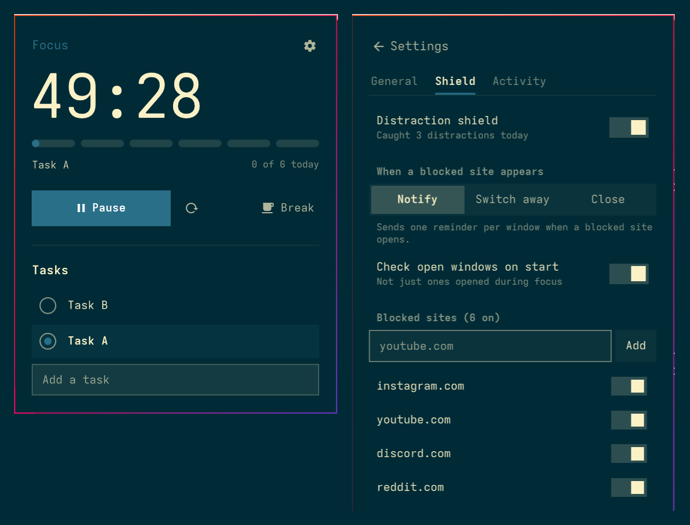

# FocusFlow

Focus timer for the Omarchy bar: pomodoro sessions, a task list, and a distraction
shield, all in one panel that follows your theme.



## Features

- **Big timer** with a session track underneath: one block per session in your daily
  goal. Finished sessions are solid, and the running one fills as time passes.
- **Tasks**: click a task to link it to the timer, or press **▶** to link it and start
  focusing in one go. Finished focus sessions are counted on the task. Ticked tasks stay
  in the list until you delete them.
- **Distraction shield**: during focus, it catches blocked sites (YouTube, Reddit, X…) in
  your browser and web apps, then notifies you, switches away, or closes the window.
- **Settings**: 25/5, 50/10 and 90/20 presets, custom lengths, a daily goal, auto-start,
  notification or full-screen alerts, and sounds.
- **Activity**: sessions today, this week and this month, and a chart of the last 7 days.
- **Bar widget**: shows the time left. Left-click opens the panel, middle-click
  pauses or resumes, and right-click resets.

## Install

```bash
omarchy plugin add https://github.com/zaki2993/focusflow --enable
```

## Remove

```bash
omarchy plugin remove zakarch.focusflow && rm ~/.local/state/omarchy/zakarch.focusflow.json
```

## Files

- `Service.qml`: timer, tasks, shield, persistence and IPC
- `Model.js`: date math, task and shield matching helpers
- `StudioWidget.qml`: bar icon
- `StudioPanel.qml`: the popup panel
- `SessionTrack.qml`, `TaskQueue.qml`, `Rhythm.qml`, `StudioButton.qml`, `StudioInput.qml`: UI pieces
- State: `~/.local/state/omarchy/zakarch.focusflow.json`

Note: the shield matches browser window titles, so it is a nudge, not a lock.
**Close** shuts the whole browser window, including its other tabs.
